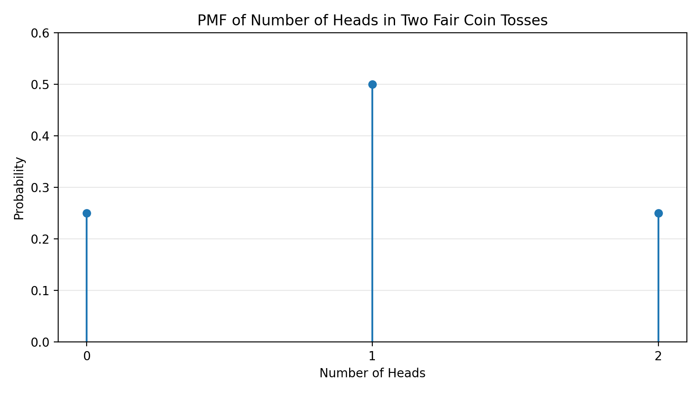

A probability mass function (PMF) describes the probability of a discrete random variable taking on a specific value. 

# Coin Toss Example

Let $X$ be the number of heads when two fair coins are tossed. The possible values are 0, 1, and 2, with probabilities:

$$
P(X = i) = \begin{cases}
\frac{1}{4}, & i = 0 \\
\frac{1}{2}, & i = 1 \\
\frac{1}{4}, & i = 2 \\
0, & \text{otherwise}
\end{cases}
$$

## Visualisation with a Stem Diagram

A stem plot like the one below is one way to visually represent the PMF. It emphasises the discrete nature of the random variable and makes it easy to compare the probabilities of different outcomes.

# Sum of a PMF

The sum of all PMF values must equal 1, because one of the possible outcomes must happen. For this example:

$$
P(X=0) + P(X=1) + P(X=2) = \frac{1}{4} + \frac{1}{2} + \frac{1}{4} = 1
$$