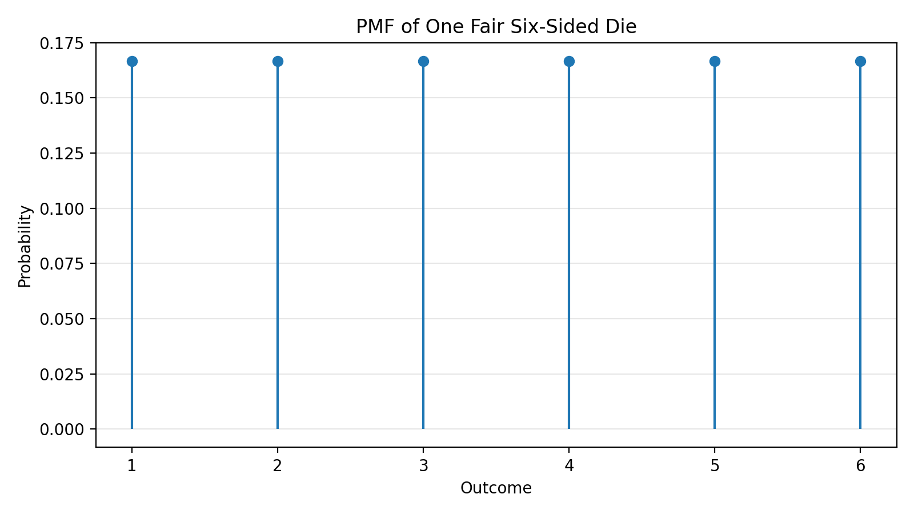

A probability mass function (PMF) describes the probability of a discrete random variable taking on a specific value. 

# Dice Example

For example, if X is a discrete random variable representing the outcome of a fair six-sided die, the PMF of X would assign a probability of 1/6 to each possible outcome (1, 2, 3, 4, 5, 6). We would represent this as:

$$
P(X = i) = \frac{1}{6}, \quad i = 1, 2, 3, 4, 5, 6
$$

## Visualisation with a Stem Diagram

A stem plot like the one below is a visual representation of the PMF, showing the probability of each outcome for the die. It emphasises the discrete nature of the random variable and makes it easy to compare the probabilities of different outcomes.

# Sum of a PMF

The sum of all values of a PMF must equal 1, as it represents the total probability of all possible outcomes of the discrete random variable. For the die example, this can be expressed as:

$$
\sum_{i=1}^{6} P(X = i) = \sum_{i=1}^{6} \frac{1}{6} = 1
$$